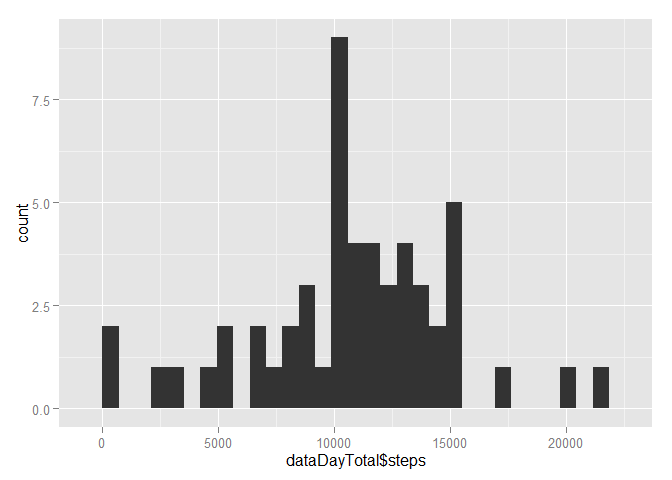
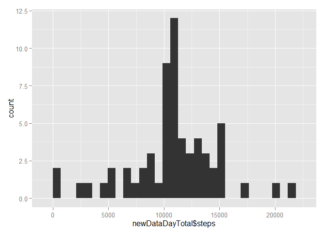
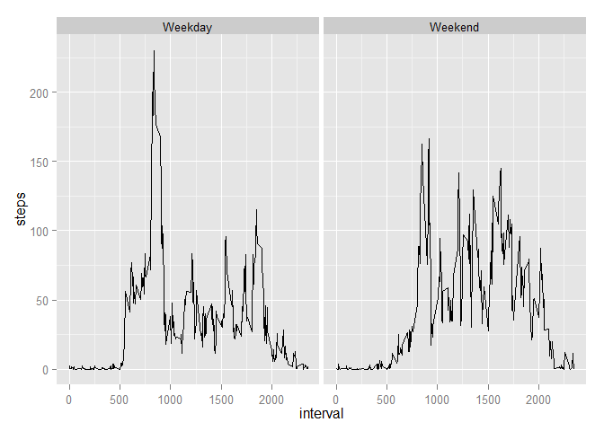

# Assignment 1: Reproducible Research
##Introduction
It is now possible to collect a large amount of data about personal movement using activity monitoring devices such as a Fitbit, Nike Fuelband, or Jawbone Up. These type of devices are part of the "quantified self" movement - a group of enthusiasts who take measurements about themselves regularly to improve their health, to find patterns in their behavior, or because they are tech geeks. But these data remain under-utilized both because the raw data are hard to obtain and there is a lack of statistical methods and software for processing and interpreting the data.

This assignment makes use of data from a personal activity monitoring device. This device collects data at 5 minute intervals through out the day. The data consists of two months of data from an anonymous individual collected during the months of October and November, 2012 and include the number of steps taken in 5 minute intervals each day.

###Version and System Information

```r
sessionInfo()
```

```
## R version 3.1.2 (2014-10-31)
## Platform: i386-w64-mingw32/i386 (32-bit)
## 
## locale:
## [1] LC_COLLATE=English_United States.1252 
## [2] LC_CTYPE=English_United States.1252   
## [3] LC_MONETARY=English_United States.1252
## [4] LC_NUMERIC=C                          
## [5] LC_TIME=English_United States.1252    
## 
## attached base packages:
## [1] stats     graphics  grDevices utils     datasets  methods   base     
## 
## loaded via a namespace (and not attached):
## [1] digest_0.6.4     evaluate_0.5.5   formatR_1.0      htmltools_0.2.6 
## [5] knitr_1.8        rmarkdown_0.3.11 stringr_0.6.2    tools_3.1.2     
## [9] yaml_2.1.13
```
###Loading and preprocessing the data

```r
library(RColorBrewer)
library(ggplot2)
setwd("C:\\Users\\ElitebookHP\\Desktop\\R_Work")
download.file("http://d396qusza40orc.cloudfront.net/repdata%2Fdata%2Factivity.zip","data.zip")
unzip("data.zip")
data <- read.csv("activity.csv")
data$date <- as.Date(data$date, "%Y-%m-%d")
dataNA <- na.omit(data)
```
###Research Question 1: What is the mean total number of steps taken per day?

```r
dataDayTotal <- aggregate(steps ~ date, FUN=sum,dataNA)
ggplot(data=dataDayTotal, aes(dataDayTotal$steps)) + geom_histogram()
```

```
## stat_bin: binwidth defaulted to range/30. Use 'binwidth = x' to adjust this.
```

 

```r
ddmean <- mean(dataDayTotal$steps)
ddmedian <- median(dataDayTotal$steps)
```
The mean of the total number of steps taken per day is: 1.0766189\times 10^{4}.
The median of the total number of steps taken per day is: 10765.

###Research Question 2: What is the average daily activity pattern?

```r
dataIntervalAvg <- aggregate(steps ~ interval, FUN=mean,dataNA)
ggplot(dataIntervalAvg, aes(x = interval, y = steps)) + geom_line()
```

 

```r
datamax <- dataIntervalAvg$interval[which.max(dataIntervalAvg$steps)]
```
The 5-minute interval which contains, on average, the maximum number of steps is interval: 835.

###Research Question 3: Imputing missing values
The number of rows containing missing data per column are:

```r
colSums(is.na(data))
```

```
##    steps     date interval 
##     2304        0        0
```
Missing values are imputed by the mean steps per interval:

```r
miss <- data[!complete.cases(data),]
dataIntervalAvg <- aggregate(steps ~ interval,FUN=mean,dataNA)
miss$steps <- NULL
imputeNA <- merge(miss,dataIntervalAvg,by="interval")
newData <- rbind(data[complete.cases(data),],imputeNA)
newDataDayTotal <- aggregate(steps ~ date, FUN=sum,newData)
ggplot(data=newDataDayTotal, aes(newDataDayTotal$steps)) + geom_histogram()
```

```
## stat_bin: binwidth defaulted to range/30. Use 'binwidth = x' to adjust this.
```

 

```r
newddmean <- mean(newDataDayTotal$steps)
newddmedian <- median(newDataDayTotal$steps)
```
The mean of the total number of steps taken per day from the imputed data set is: 1.0766189\times 10^{4}.
The median of the total number of steps taken per day from the imputed data set is: 1.0766189\times 10^{4}.
The imputation has negated any difference between the mean steps taken per day and the median steps taken per day.

###Research Question 4: Are there differences in activity patterns between weekdays and weekends?

```r
newData$day <- ifelse((weekdays(newData$date) == "Sunday") | (weekdays(newData$date) == "Saturday"),"Weekend","Weekday")
daydataIntervalAvg <- aggregate(newData$steps, by=list(newData$day,newData$interval), FUN=mean)
colnames(daydataIntervalAvg) <- c("day","interval", "steps")
ggplot(daydataIntervalAvg, aes(x = interval, y = steps)) + geom_line() + facet_wrap(~day, nrow=1)
```

 
